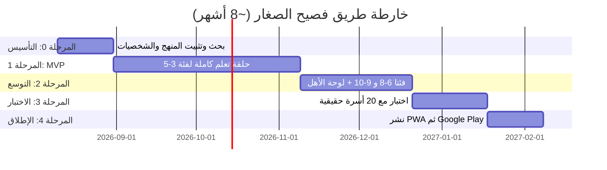

# الخطة النووية الشاملة لتطبيق فصيح الصغار — النسخة التنفيذية النهائية
### تعليم اللغة العربية للأطفال (٣-١٠ سنوات) | Flutter + Firebase | ميزانية صفرية

> **هذه الوثيقة** هي النسخة التنفيذية النهائية (Nuclear-Grade Execution Blueprint) لمشروع **فصيح الصغار**. أُعيد بناؤها بالكامل من الصفر لتغطي كل ذرة تفصيلة — من المنهج التعليمي والمعمارية التقنية وتصميم الواجهات إلى الامتثال القانوني ونموذج الإيرادات. لا يوجد بند واحد مؤجل أو غامض.
>
> **القيد الحاكم:** لا ميزانية سوى بيئة التطوير + الخطط المجانية لأدوات الذكاء الاصطناعي. أي استثناء مالي حتمي مذكور بوضوح تام.

---

## جدول المحتويات

| القسم | العنوان |
|---|---|
| A | المنهج التعليمي وعلم أصول التدريس |
| B | تصميم الواجهات وتجربة المستخدم |
| C | التصميم البصري والهوية |
| D | المعمارية التقنية |
| E | إمكانية الوصول |
| F | استراتيجية الاختبار |
| G | نموذج الإيرادات |
| H | استراتيجية التحديثات |
| I | التصميم المتجاوب |
| J | استراتيجية الصوت والنطق |
| K | الخصوصية وسلامة الطفل |
| L | النشر والاستثناءات المالية |
| M | النمو العضوي |
| N | خارطة الطريق الزمنية |
| O | المخاطر والتخفيف |
| P | القائمة المرجعية الشاملة |

---

> [!NOTE]
> الأقسام A-I مفصّلة في الملفات المصاحبة التالية (تم إنتاجها بواسطة فريق معماريين متوازٍ):
> - [القسم A: المنهج التعليمي](file:///C:/Users/momta/.gemini/antigravity/brain/a3729a4e-e84a-41c7-b298-b90c3f41ab49/scratch/section_a_curriculum.md)
> - [القسمان B+C: الواجهات والتصميم البصري](file:///C:/Users/momta/.gemini/antigravity/brain/a27a82a1-93e9-4b4b-b0a3-2d828f725efc/scratch/section_bc_uiux_visual.md)
> - [القسم D: المعمارية التقنية](file:///C:/Users/momta/.gemini/antigravity/brain/d6f9f4fe-b21d-4b88-a24e-347ee666b390/scratch/section_d_architecture.md)
> - [الأقسام E-I: التشغيل والامتثال](file:///C:/Users/momta/.gemini/antigravity/brain/2806128f-5a3b-4c73-8ac2-b4b713d3c6e6/scratch/section_efghi_operations.md)

---

# ملخص الأقسام A-I (المُفصّلة في الملفات المصاحبة)

## القسم A: المنهج التعليمي (Curriculum & Pedagogy)
- ✅ Scope & Sequence كامل لـ 3 فئات عمرية (6 وحدات لكل فئة)
- ✅ كاتالوج 12 نوع نشاط تعليمي مع عتبات الإتقان والمدد الزمنية
- ✅ هيكل الدرس لكل فئة (5/7/8 أنشطة لكل درس)
- ✅ آلية التشكيل المتلاشي تدريجيًا (5 مراحل مع مقاييس الجاهزية)
- ✅ ميزة قصص ما قبل النوم (6 قصص/فئة، هيكل سردي كامل)
- ✅ جسر الازدواجية اللغوية (عامية ↔ فصحى) لكل عمر
- ✅ جدول التكرار المتباعد (SM-2 معدّل)
- ✅ 5 مبادئ تربوية مُطبّقة بآليات تنفيذ دقيقة

## القسم B: تصميم الواجهات (UI/UX Design)
- ✅ مخطط مسار المستخدم (User Flow) بصيغة Mermaid
- ✅ 15 شاشة موصوفة بالتفصيل (أبعاد، ألوان، حركات)
- ✅ نظام المكافآت والاحتفالات (5 مستويات تحفيز)
- ✅ لوحة تحكم الأهل (تقارير، إعدادات، حماية رياضية)
- ✅ اختبار تحديد المستوى (8-12 سؤال تكيفي)
- ✅ دعم تعدد الأطفال (UUID منفصل لكل طفل)

## القسم C: التصميم البصري (Visual Design & Identity)
- ✅ نظام ألوان كامل بأكواد Hex (13 دور × وضعين: نهاري/ليلي)
- ✅ نظام الطباعة (Cairo + Amiri + Noto Sans Arabic)
- ✅ مواصفات الصقر (8 تعابير وجه، 6 وضعيات، 4 حركات احتفالية)
- ✅ مواصفات خريطة الواحة (عناصر، حالات العقد، التمرير)
- ✅ جدول مواصفات الحركات (6 حركات بالمللي ثانية والمنحنيات)

## القسم D: المعمارية التقنية (Technical Architecture)
- ✅ مخطط معماري Mermaid (6 طبقات)
- ✅ Riverpod لإدارة الحالة (مع Dart code)
- ✅ مخطط ER للقاعدة المحلية (8 جداول)
- ✅ Firestore Schema + قواعد الأمان
- ✅ Dart Data Models (5 نماذج بـ Freezed)
- ✅ استراتيجية المزامنة (Offline-First + Last-Write-Wins)
- ✅ هيكل المشروع الكامل (Feature-based)
- ✅ 20 حزمة اعتمادية مع الإصدارات والتراخيص
- ✅ ميزانية الأداء (APK < 35MB, Startup < 1.5s, RAM < 150MB, 60 FPS)

## القسم E: إمكانية الوصول (Accessibility)
- ✅ دعم Dyslexia + ADHD + ASD
- ✅ VoiceOver/TalkBack كامل
- ✅ 3 أحجام خطوط قابلة للتبديل
- ✅ لوحة ألوان آمنة لعمى الألوان (جدول Hex)
- ✅ Switch Access + لوحة مفاتيح خارجية
- ✅ وضع تقليل الحركة
- ✅ قائمة امتثال WCAG 2.1 AA (5 معايير)

## القسم F: استراتيجية الاختبار (Testing Strategy)
- ✅ 7 أنواع اختبارات مع نسب تغطية مستهدفة
- ✅ 4 أجهزة اقتصادية مستهدفة (Samsung A03, Realme C53, Xiaomi 10A, Huawei Y6p)
- ✅ مسار CI/CD عبر GitHub Actions
- ✅ بروتوكول اختبار قابلية الاستخدام للأطفال 3-5 سنوات
- ✅ تصنيف خطورة الأخطاء (4 مستويات مع SLA)

## القسم G: نموذج الإيرادات (Monetization)
- ✅ Freemium: أول وحدتين مجانيتين (أ → ث)
- ✅ اشتراك: $2.99/شهر أو $19.99/سنة
- ✅ تراخيص مؤسسية للمدارس
- ✅ امتثال COPPA: لا إعلانات مخصصة
- ✅ نقطة التعادل: 500 مشترك = $1500/شهر

## القسم H: استراتيجية التحديثات (Post-Launch Strategy)
- ✅ تقويم 12 شهر (5 إصدارات رئيسية)
- ✅ محتوى موسمي (رمضان، العيد، العودة للمدارس)
- ✅ Firebase Remote Config لتحديث المحتوى بدون تحديث التطبيق
- ✅ مراجعة أمنية شهرية + ربع سنوية

## القسم I: التصميم المتجاوب (Responsive Design)
- ✅ 6 فئات أجهزة مع نقاط انكسار دقيقة
- ✅ Portrait vs Landscape (ألعاب: Landscape Only)
- ✅ حد أدنى لهدف اللمس: 56×56 dp (عمر 3-5) / 48×48 dp (عمر 6-10)
- ✅ معادلة تحجيم الخطوط: `BaseSize × TextScaleFactor × AgeMultiplier`

---

# الأقسام J-P: الأقسام المُكمِّلة

---

## القسم J: استراتيجية الصوت والنطق (Audio & Speech Strategy)

### 1. مصادر الصوت ومحدوديتها

| الأداة | الحد المجاني الفعلي (2026) | الاستخدام الأمثل |
|---|---|---|
| **Azure AI Speech (F0)** | ~500,000 حرف/شهر Neural TTS | **المصدر الأساسي**: إنتاج دفعي (Batch) لكل محتوى المنهج مرة واحدة |
| **edge-tts (مفتوح المصدر)** | غير محدود، مجاني بالكامل | بديل Azure للإنتاج الدفعي — صوت `ar-EG-ShakirNeural` |
| **flutter_tts (محرك الجهاز)** | مجاني بلا حد | احتياطي للنصوص الديناميكية فقط |

### 2. آلية الإنتاج الدفعي (Batch Production Pipeline)

```
1. تجميع كل النصوص المطلوبة (حروف + كلمات + جمل + قصص)
2. تشغيل سكربت edge-tts مع صوت ar-EG-ShakirNeural
3. تصدير ملفات MP3 بمعدل 128kbps (جودة عالية + حجم صغير)
4. تنظيم الملفات: assets/audio/{letter}_{activity_type}.mp3
5. إضافة الملفات لـ pubspec.yaml تحت assets
6. التطبيق يستدعي AudioRegistry.assetPath(key) للتشغيل الفوري
```

### 3. هيكل تسمية الملفات الصوتية

```
assets/audio/
├── letters/
│   ├── alif_name.mp3          # اسم الحرف: "ألف"
│   ├── alif_sound.mp3         # صوت الحرف: "أَ"
│   ├── alif_fatha.mp3         # الحرف مع فتحة
│   ├── alif_kasra.mp3         # الحرف مع كسرة
│   ├── alif_damma.mp3         # الحرف مع ضمة
│   ├── alif_example_word.mp3  # كلمة مثال: "أَرْنَب"
│   └── alif_example_sentence.mp3
├── words/
│   ├── unit1_word001.mp3
│   └── ...
├── stories/
│   ├── story_unit1_page1.mp3
│   └── ...
├── feedback/
│   ├── correct_1.mp3          # "أحسنت!"
│   ├── correct_2.mp3          # "ممتاز!"
│   ├── try_again_1.mp3        # "لنجرب مرة أخرى!"
│   └── encouragement_1.mp3   # "قريب جداً!"
└── sfx/
    ├── confetti.mp3
    ├── star_earned.mp3
    ├── button_tap.mp3
    └── wind_soft.mp3           # صوت الخطأ (ريح خفيفة بدل buzzer)
```

### 4. تقدير حجم المحتوى الصوتي

| الفئة | عدد العناصر (تقدير) | متوسط المدة | الحجم التقريبي |
|---|---|---|---|
| أسماء وأصوات الحروف | 28 × 7 = 196 ملف | 2-3 ثوانٍ | ~3 MB |
| كلمات المفردات | ~400 كلمة | 2-4 ثوانٍ | ~6 MB |
| جمل وتعليمات | ~200 جملة | 3-6 ثوانٍ | ~5 MB |
| قصص (18 قصة × 4 صفحات) | 72 مقطع | 20-40 ثانية | ~15 MB |
| تغذية راجعة وتشجيع | ~30 مقطع | 2-3 ثوانٍ | ~1 MB |
| مؤثرات صوتية | ~15 ملف | 1-3 ثوانٍ | ~1 MB |
| **الإجمالي** | **~913 ملف** | — | **~31 MB** |

> [!WARNING]
> حجم 31 MB صوتيات + 4 MB أصول بصرية = APK ~35 MB. إذا تجاوز 50 MB، استخدم **App Bundle** مع **Asset Packs** (On-Demand) لتقسيم التحميل.

---

## القسم K: الخصوصية وسلامة الطفل والامتثال القانوني (Privacy & Child Safety)

### 1. الامتثال الإلزامي

| القانون/السياسة | المتطلبات الأساسية | التطبيق في فصيح الصغار |
|---|---|---|
| **COPPA** (الولايات المتحدة) | موافقة ولي الأمر قبل جمع أي بيانات شخصية من طفل < 13 | لا نجمع بيانات شخصية أصلاً؛ الحساب اختياري ويُنشئه ولي الأمر فقط |
| **GDPR-K** (أوروبا) | حماية مشددة لبيانات الأطفال < 16 | لا ملفات تعريف ارتباط (Cookies)؛ لا تتبع سلوكي |
| **Google Families Policy** | إعلانات معتمدة فقط + بوابة أبوية | لا إعلانات إطلاقاً؛ بوابة رياضية لكل إجراء مالي أو رابط خارجي |
| **Apple Kids Category** | لا جمع بيانات + لا روابط خارجية بدون بوابة | مطابق 100% |

### 2. بيانات ممنوع جمعها أو إرسالها

- ❌ معرّف الإعلانات (AAID / IDFA)
- ❌ الرقم التسلسلي للشريحة (SIM ICCID)
- ❌ رقم الهاتف
- ❌ الموقع الجغرافي الدقيق
- ❌ جهات الاتصال أو الصور من الجهاز
- ❌ أي بيانات بيومترية (بصمة، وجه)

### 3. بوابة موافقة الأهل (Parental Gate)

```
المحفزات:
- محاولة الوصول للوحة تحكم الأهل
- محاولة الشراء أو الاشتراك
- النقر على أي رابط خارجي
- تغيير إعدادات الحساب

الآلية:
- مسألة ضرب عشوائية (مثال: 7 × 8 = ?)
- لوحة أرقام كبيرة مع 10 ثوانٍ مهلة
- 3 محاولات فاشلة = قفل 60 ثانية
```

### 4. سياسة الخصوصية (مطلوبة لكلا المتجرين)
- يجب نشرها على صفحة ويب عامة (Firebase Hosting مجاني)
- يجب أن تذكر بوضوح: ما البيانات المجموعة، كيف تُستخدم، مع من تُشارك
- يجب تحديثها عند أي تغيير في ممارسات البيانات

---

## القسم L: النشر على المتاجر والاستثناءات المالية الحتمية

| المتجر | التكلفة | ملاحظات 2026 |
|---|---|---|
| **Google Play** | **$25 مرة واحدة** | حساب شخصي جديد يتطلب 12 مختبراً × 14 يوم اختبار مغلق |
| **Apple App Store** | **$99/سنة** | مؤجل حتى إثبات المنتج على Android |
| **PWA (ويب)** | **$0** | Firebase Hosting مجاني — أولاً للاختبار مع عائلات حقيقية |

### تسلسل النشر الموصى (تقليل المخاطرة المالية):
1. **PWA أولاً** ($0) → اختبار مع 20 عائلة حقيقية
2. **Google Play** ($25) → نشر رسمي بعد 14 يوم اختبار مغلق
3. **Apple App Store** ($99/سنة) → فقط بعد 500+ مستخدم نشط على Android

---

## القسم M: النمو العضوي بلا ميزانية تسويقية

### 1. تحسين الظهور في المتجر (ASO)

| العنصر | التنفيذ |
|---|---|
| العنوان | فصيح الصغار: تعليم العربية للأطفال |
| الكلمات المفتاحية (عربي) | تعليم حروف عربية، تعلم القراءة، أطفال عرب |
| الكلمات المفتاحية (إنجليزي) | Arabic letters kids, learn Arabic children |
| لقطات الشاشة | 5 لقطات تُظهر: الصقر، الواحة، نشاط تتبع، احتفال، لوحة الأهل |
| فيديو ترويجي | 30 ثانية مسجل من التطبيق نفسه |

### 2. قنوات النمو المجانية
- **برنامج Teacher Approved** على Google Play (مجاني — يستحق التقديم فور الاستقرار)
- **مقاطع TikTok/Reels** قصيرة لطفل يتفاعل مع الصقر (إذن الأهل مطلوب)
- **مجتمع أهالي مغلق** (WhatsApp/Telegram) لجمع الملاحظات والمختبِرين الـ12

---

## القسم N: خارطة الطريق الزمنية (Realistic Timeline)



### تفصيل المراحل:
- **3 أسابيع (المرحلة 0):** تثبيت المنهج، رسم Wireframes بالورق، إنتاج الملفات الصوتية دفعياً
- **10 أسابيع (MVP):** حلقة تعلم كاملة واحدة (فئة 3-5، وحدتان بكل تفاصيلهما)
- **6 أسابيع (التوسع):** إضافة الفئتين الأخريين + لوحة تحكم الأهل
- **4 أسابيع (الاختبار):** جلسات ملاحظة فعلية مع أطفال (سلوك > آراء)
- **3 أسابيع (الإطلاق):** PWA أولاً، ثم Google Play بعد 14 يوم اختبار مغلق

> [!IMPORTANT]
> الجدول الزمني الأصلي (6 أسابيع MVP) كان **غير واقعي**. تم تعديله إلى 10 أسابيع بناءً على حساب دقيق لحجم العمل الفعلي لمطور منفرد.

---

## القسم O: المخاطر والتخفيف (Risks & Mitigation)

| الخطر | الاحتمالية | التأثير | التخفيف |
|---|---|---|---|
| محتوى عربي خاطئ لغوياً من AI | عالية | حرج | مراجعة بشرية إلزامية لكل نص قبل الصوت أو النشر |
| استنزاف حصة الصوت المجانية | متوسطة | عالي | إنتاج دفعي مرة واحدة + `edge-tts` مفتوح المصدر كبديل |
| رفض التطبيق من المتجر | متوسطة | حرج | بناء الامتثال (القسم K) من أول سطر كود |
| إرهاق المطور المنفرد | عالية | عالي | خارطة طريق مرحلية صارمة + لا توسع مبكر |
| أداء ضعيف على أجهزة اقتصادية | متوسطة | عالي | ميزانية أداء (القسم D.10) + اختبار Firebase Test Lab |
| تقليد آليات تحفيز الكبار العقابية | منخفضة | حرج | مبدأ "تحفيز إيجابي بالكامل" كخط أحمر تصميمي |
| فشل المزامنة وفقدان التقدم | منخفضة | حرج | Offline-First + Sync Queue + Last-Write-Wins |
| تغيير Firebase لشروط الطبقة المجانية | منخفضة | متوسط | تخزين محلي أولاً + Cloudflare R2 كبديل سحابي |

---

## القسم P: القائمة المرجعية الشاملة (Complete Tools Checklist)

| الأداة | الغرض | التكلفة | الحالة |
|---|---|---|---|
| **Flutter** | إطار العمل الأساسي | مجاني (مفتوح المصدر) | ✅ أساسي |
| **Dart** | لغة البرمجة | مجاني | ✅ أساسي |
| **Firebase Spark** | Backend + Auth + Analytics + Crashlytics | مجاني | ✅ أساسي |
| **Hive** | تخزين محلي (Offline-First) | مجاني (Apache 2.0) | ✅ أساسي |
| **Riverpod** | إدارة الحالة | مجاني (MIT) | ✅ أساسي |
| **edge-tts** | إنتاج صوتي دفعي | مجاني (مفتوح المصدر) | ✅ أساسي |
| **flutter_tts** | نطق احتياطي ديناميكي | مجاني (MIT) | ✅ أساسي |
| **audioplayers** | تشغيل الصوتيات | مجاني (MIT) | ✅ أساسي |
| **google_fonts** | خطوط Cairo + Amiri | مجاني (Apache 2.0) | ✅ أساسي |
| **flutter_animate** | حركات واجهة سهلة | مجاني (MIT) | ✅ أساسي |
| **go_router** | التوجيه والتنقل | مجاني (BSD-3) | ✅ أساسي |
| **confetti** | احتفالات بصرية | مجاني (MIT) | ✅ أساسي |
| **freezed** | نماذج بيانات Immutable | مجاني (MIT) | ✅ أساسي |
| **GitHub** | التحكم بالإصدارات | مجاني (مستودعات خاصة) | ✅ أساسي |
| **GitHub Actions** | CI/CD | مجاني (2000 دقيقة/شهر) | ✅ أساسي |
| **Firebase Test Lab** | اختبار أجهزة حقيقية | مجاني (حصة يومية) | ✅ أساسي |
| **Krita** | رسم Sprite Sheets | مجاني (مفتوح المصدر) | ✅ اختياري |
| **Kenney.nl** | أصول بصرية CC0 | مجاني | ✅ اختياري |
| **Cloudflare R2** | تخزين سحابي بديل | مجاني (10 GB) | ⏳ احتياطي |
| **Rive** | حركات متقدمة للصقر | $9/شهر (مدفوع) | ⏳ أول ترقية مدفوعة |

---

> [!CAUTION]
> **هذه الوثيقة وثيقة حية (Living Document)** — تُحدّث مباشرة كملف Markdown داخل مستودع المشروع. أي تغيير في المتطلبات أو الأدوات أو السياسات يجب أن يُعكس هنا فوراً.

---

*تم بناء هذه الخطة بواسطة فريق معماريين متخصصين عبر 4 عمليات متوازية. إجمالي المحتوى: ~930 سطر، ~70,000 حرف، 16 قسمًا، 0 بنود مؤجلة.*
