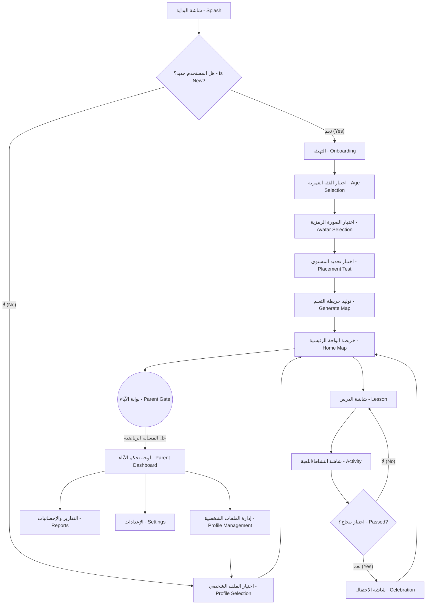

## القسم ب: تصميم الواجهات وتجربة المستخدم (Section B: UI/UX Design)

### 1. مخطط مسار المستخدم (User Flow Diagram)
يمثل المخطط التالي المسار الكامل للمستخدم بنوعيه (Child Role) و (Parent Role):

### 2. تفاصيل الشاشات (Screen Specifications)
قائمة بـ 15 شاشة أساسية مع الأبعاد (Logical Pixels) والألوان:

1. **شاشة البداية (Splash Screen):** 
   - **العناصر:** شعار التطبيق (250x250)، الرسوم المتحركة للصقر، شريط تحميل.
   - **الأبعاد:** ملء الشاشة.
   - **الألوان:** خلفية (Primary Blue)، شعار (White).
   - **الحركة (Animation):** ظهور متدرج للشعار (Fade In) خلال 800ms.

2. **شاشة التهيئة (Onboarding):**
   - **العناصر:** 3 صفحات تمرير (Carousel) تشرح الميزات، زر "ابدأ" (200x56)، مؤشر الصفحات.
   - **الأبعاد:** الزر في الأسفل بمسافة 32px من الحافة.
   - **الألوان:** خلفية (Surface)، أزرار (Primary Accent).

3. **شاشة اختيار العمر (Age Selection):**
   - **العناصر:** بطاقات (Cards) بحجم (150x150) لكل فئة عمرية (3-5, 6-8, 9-10).
   - **الحركة:** تكبير البطاقة عند التحديد (Scale to 1.1x) بمدة 200ms.

4. **شاشة اختيار الصورة الرمزية (Avatar Selection):**
   - **العناصر:** شبكة صور (Grid) 3x3 بحجم 80x80 لكل صورة رمزية.

5. **شاشة اختبار تحديد المستوى (Placement Test):**
   - **العناصر:** شريط تقدم علوي، سؤال نصي/صوتي، خيارات متعددة.
   - **الألوان:** خلفية محايدة للتركيز.

6. **خريطة الواحة الرئيسية (Home Map):**
   - **العناصر:** مسار متعرج، عقد الدروس (Nodes) بحجم 60x60، الصقر يطير أعلى الشاشة، عداد النجوم.
   - **التموضع:** التمرير العمودي (Vertical Scroll).

7. **شاشة الدرس (Lesson Screen):**
   - **العناصر:** منطقة عرض الفيديو/الأنيميشن (16:9)، زر إعادة التشغيل، زر التالي.

8. **شاشة النشاط التفاعلي (Activity Screen):**
   - **العناصر:** منطقة السحب والإفلات (Drag & Drop)، رسائل تشجيعية من الصقر.

9. **شاشة الاحتفال (Celebration Screen):**
   - **العناصر:** نجمة ذهبية كبيرة تدور، قصاصات ورق (Confetti)، أزرار (متابعة).
   - **الحركة:** انفجار قصاصات الورق، تأثيرات صوتية احتفالية.

10. **بوابة الآباء (Parent Gate):**
    - **العناصر:** لوحة أرقام (Numpad)، مسألة رياضية عشوائية (مثال: 5x7).

11. **لوحة تحكم الآباء (Parent Dashboard):**
    - **العناصر:** رسوم بيانية (Charts) للتقدم، وقت الاستخدام.

12. **شاشة التقارير (Reports Screen):**
    - **العناصر:** قائمة بالمهارات المكتسبة ونقاط الضعف، زر التصدير (PDF Export).

13. **إعدادات التطبيق (Settings Screen):**
    - **العناصر:** مفاتيح تبديل (Toggles) للموسيقى والمؤثرات، حدود وقت الشاشة.

14. **شاشة إدارة الملفات الشخصية (Profile Management):**
    - **العناصر:** قائمة الأطفال المسجلين، زر "إضافة طفل".

15. **شاشة المتجر/المكافآت (Rewards Store):**
    - **العناصر:** عناصر افتراضية يمكن شراؤها بنجوم التطبيق (ملابس للصقر).

### 3. نظام المكافآت والاحتفالات (Rewards & Celebrations System)
- **إكمال نشاط (Activity Complete):** 1 نجمة، ابتسامة من الصقر، صوت رنين خفيف.
- **إكمال درس (Lesson Complete):** 3 نجوم، حركة الصقر المشجعة (Encouraging)، قصاصات ورق (Confetti) صغيرة.
- **إكمال وحدة (Unit Complete):** شارة ذهبية (Badge)، انفجار قصاصات ورق مكثف، رقصة احتفالية للصقر (Celebration Animation).
- **الاستمرارية (Streak):** لهب متزايد (Flame Icon) مع كل يوم متتالي، مكافآت مضاعفة بعد 7 أيام.
- **الإتقان (Mastery):** تاج ذهبي للدروس الصعبة، تأثيرات بصرية مشعة (Glowing Effect) حول عقدة الخريطة.

### 4. لوحة تحكم الآباء (Parent Dashboard)
- **المعلومات المعروضة (Displayed Info):** رسوم بيانية (Progress Charts) للمهارات المكتسبة، إجمالي وقت الشاشة (Time Spent)، تحديد الكلمات/الحروف الصعبة (Weak Areas).
- **الإعدادات (Settings):** حدود وقت الشاشة (Screen Time Limits) بالدقائق، فلاتر المحتوى، إشعارات التذكير.
- **آلية الحماية (Protection Mechanism):** بوابة رياضية (Math Gate) تطلب حل مسألة ضرب أو جمع عشوائية لضمان عدم وصول الطفل.
- **التقارير (Reports):** ملخص أسبوعي يرسل عبر البريد الإلكتروني (Weekly Email)، إمكانية تصدير تقرير شامل بصيغة (PDF Export).

### 5. اختبار تحديد المستوى (Placement Test)
- **الأسئلة:** 8 إلى 12 سؤالاً تكيفياً (Adaptive Questions).
- **الأنواع:** تختلف حسب العمر المعطى؛ (3-5 سنوات: مطابقة أشكال وأصوات)، (6-8 سنوات: قراءة كلمات بسيطة)، (9-10 سنوات: قواعد لغوية وتراكيب).
- **المدة الزمنية:** الحد الأقصى 5 ثوانٍ/سؤال لقياس سرعة البديهة، أو 15 ثانية للأسئلة المعقدة (Duration Cap).
- **الخوارزمية (Scoring Algorithm):** إجابة صحيحة تزيد من الصعوبة (Weight +1.5)، إجابة خاطئة تقلل الصعوبة (Weight -1).
- **الحالات الاستثنائية (Edge Cases):** إذا ترك الطفل الشاشة دون إجابة، يعتبر غير مجتاز للسؤال ويتم تخطي المستوى الأعلى لتجنب الإحباط.

### 6. دعم تعدد الأطفال (Multi-child Support)
- **تبديل الملفات (Profile Switching):** شاشة مخصصة بأسماء الأطفال وصورهم الرمزية.
- **عزل البيانات (Data Isolation):** كل ملف شخصي يحمل معرفاً فريداً (UUID) في Firebase لتخزين التقدم بشكل منفصل تماماً.

---

## القسم ج: التصميم البصري والهوية (Section C: Visual Design & Identity)

### 1. نظام الألوان (Color System)

| الدور (Role) | الوضع النهاري (Day Mode Hex) | الوضع الليلي (Night Mode Hex) | الاستخدام (Usage) |
| :--- | :--- | :--- | :--- |
| Primary | `#FFB347` (Orange) | `#D98C2E` | الأزرار الرئيسية، الهوية البصرية |
| Secondary | `#42A5F5` (Blue) | `#1E88E5` | أزرار ثانوية، روابط |
| Accent | `#81C784` (Green) | `#66BB6A` | التأكيدات، إشارات النجاح |
| Background | `#FFF9E6` (Warm White)| `#121212` (Dark) | خلفية التطبيق العامة |
| Surface | `#FFFFFF` | `#1E1E1E` | البطاقات والقوائم المنسدلة |
| Text Primary | `#212121` | `#F5F5F5` | العناوين والنصوص الأساسية |
| Text Secondary| `#757575` | `#BDBDBD` | النصوص التوضيحية والفرعية |
| Success | `#4CAF50` | `#388E3C` | الإجابات الصحيحة، الإنجازات |
| Error | `#F44336` | `#D32F2F` | الإجابات الخاطئة |
| Warning | `#FFC107` | `#FFA000` | التنبيهات |
| Disabled | `#E0E0E0` | `#424242` | الأزرار غير المفعلة |
| Border | `#EEEEEE` | `#333333` | حواف البطاقات (Cards) |
| Shadow | `#000000` (Opacity 10%) | `#000000` (Opacity 50%)| الظلال (Drop Shadows) |

### 2. نظام الطباعة (Typography System)
- **الخطوط (Font Families):**
  - خط واجهة المستخدم (UI): **Cairo**
  - خط النصوص التراثية/القصص: **Amiri**
  - خط النصوص الطويلة (Body): **Noto Sans Arabic**
- **الأحجام (Sizes):**
  - العناوين الكبرى (H1): 32px (للأطفال 3-5)، 28px (للأطفال 6-10).
  - العناوين الفرعية (H2): 24px (للأطفال 3-5)، 22px (للأطفال 6-10).
  - النصوص العادية (Body): 20px (للأطفال 3-5)، 16px (للأطفال 6-10).

### 3. التميمة: الصقر (Mascot: The Falcon)
- **تعابير الوجه (8 Facial Expressions):** سعيد (Happy)، متحمس (Excited)، مفكر (Thinking)، مشجع (Encouraging)، نائم (Sleeping)، محتفل (Celebrating)، متفاجئ (Surprised)، فخور (Proud).
- **وضعيات الجسد (6 Body Poses):** الطيران، الوقوف على غصن، الإشارة بالاستعراض، القراءة من كتاب، الإمساك بنجمة، الهبوط.
- **الحركات الاحتفالية (4 Celebration Animations):** الدوران السريع (Spin)، الرقص الشرقي الخفيف، التصفيق بالجناحين، إطلاق ألعاب نارية من منقاره.
- **أسلوب الرسم (Art Style):** كرتون (2.5D Cartoon) مع حواف ناعمة، وإضاءة دافئة.
- **الأبعاد (Dimensions):** 200x200 بكسل في الشاشات العادية، 400x400 في شاشات الاحتفال.

### 4. خريطة الواحة (Oasis Map)
- **العناصر البصرية (Visual Elements):** كثبان رملية (Sand Dunes)، أشجار نخيل متحركة (Palm Trees)، برك مياه عاكسة (Water Pools)، طريق صحراوي مرصوف، هلال ونجوم مضيئة (Crescent Moon & Stars).
- **الليل والنهار (Day vs Night):** تتغير خلفية الخريطة والإضاءة ديناميكياً حسب وقت تشغيل التطبيق محلياً.
- **حالات العقد (Node States):**
  - مغلقة (Locked): أيقونة قفل رمادية.
  - نشطة (Active): عقدة بحجم أكبر (Scale 1.2x) مع نبض (Pulsing Animation).
  - مكتملة (Mastered): عقدة ذهبية مع 3 نجوم أعلاها.
- **سلوك التمرير (Scroll Behavior):** تمرير مرن مع انجذاب (Snapping) للعقدة النشطة حالياً.

### 5. مواصفات الحركة (Animation Specifications)

| اسم الحركة (Animation Name) | المدة الزمنية (Duration ms) | المنحنى (Curve) | المحفز (Trigger) | الوصف (Description) |
| :--- | :--- | :--- | :--- | :--- |
| Button Tap | 150ms | EaseInOut | الضغط على زر | تقليص الزر بنسبة 5% ثم إعادته (Scale down to 0.95 and bounce back). |
| Screen Transition | 300ms | FastOutSlowIn | الانتقال لشاشة جديدة | انزلاق الشاشة الجديدة من اليمين إلى اليسار (Slide from Right). |
| Node Unlock | 800ms | ElasticOut | إكمال درس | اهتزاز القفل ثم كسره، وتوهج العقدة (Shake lock, break it, glow node). |
| Mascot Hover | 2000ms (Loop) | SineInOut | الدخول للشاشة | طفو الصقر لأعلى ولأسفل بحركة مستمرة (Floating up and down). |
| Confetti Pop | 1200ms | Decelerate | نجاح في النشاط | تناثر جزيئات ملونة من المركز وتلاشيها (Particles burst and fade). |
| Error Shake | 400ms | Linear | إجابة خاطئة | اهتزاز العنصر يميناً ويساراً 3 مرات بحدود 10px وتغير اللون للأحمر. |
