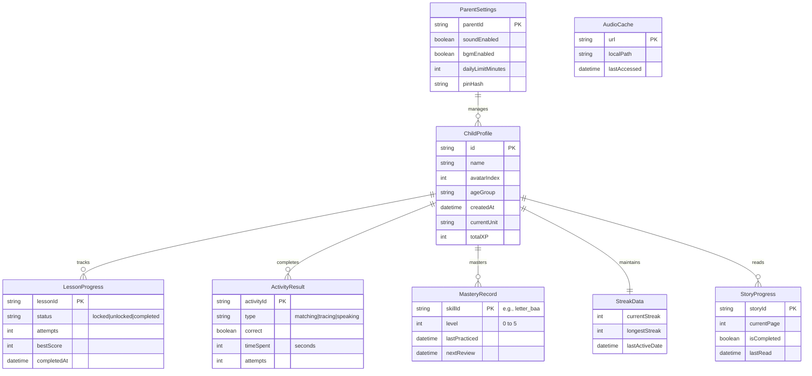

# القسم الرابع: المعمارية التقنية (Technical Architecture)

بصفتي كبير مهندسي المعمارية، أقدم هنا المخطط الهندسي الدقيق (Execution Blueprint) لتطبيق "فصيح الصغار" (Faseeh Kids). المعمارية مصممة لتكون قابلة للتوسع (Scalable)، تعمل بكفاءة دون اتصال (Offline-First)، وبميزانية تشغيلية صفرية (Zero Budget) تعتمد على طبقة Firebase المجانية (Spark Plan). 

## 1. المخطط المعماري للنظام (Architecture Diagram)

يوضح المخطط التالي الطبقات المعمارية الأساسية للتطبيق، بدءاً من واجهة المستخدم (Presentation Layer) وصولاً إلى قواعد البيانات المحلية والسحابية.

```mermaid
graph TD
    %% Presentation Layer
    subgraph Presentation Layer
        UI[Screens & Widgets]
        Anim[Animations - Lottie/Rive]
    end

    %% Business Logic Layer
    subgraph Business Logic Layer
        Providers[Riverpod Providers]
        Controllers[Screen Controllers]
    end

    %% Data Layer
    subgraph Data Layer
        Repo[Repositories]
        Sync[Sync Manager]
    end

    %% Services Layer
    subgraph Services Layer
        Audio[Audio Service]
        TTS[TTS Service]
        Analytics[Analytics Service]
    end

    %% Local Storage
    subgraph Local Storage
        Hive[(Hive Local DB)]
        Isar[(Isar - Optional for Search)]
        Prefs[Shared Preferences]
    end

    %% Remote Storage (Firebase)
    subgraph Remote Storage
        Firestore[(Cloud Firestore)]
        Auth[Firebase Auth]
        FStorage[(Firebase Storage)]
    end

    %% Dependencies
    UI <--> Providers
    Anim --> UI
    Providers <--> Controllers
    Controllers <--> Repo
    Controllers --> Services Layer
    Repo <--> Sync
    Sync <--> Hive
    Sync <--> Firestore
    Repo --> Hive
    Repo --> Isar
    Auth --> Providers
```

## 2. إدارة الحالة (State Management)

تم اختيار **Riverpod** لإدارة الحالة كبديل لـ BLoC/Cubit. 

**مبررات الاختيار (Justification):**
1. **أمان وقت الترجمة (Compile-time Safety):** يمنع أخطاء (ProviderNotFoundException) التي تحدث مع Provider العادي.
2. **استقلالية شجرة العناصر (Widget Tree Independence):** يمكن قراءة الحالة من أي مكان (مثل الخدمات والتوجيه Router).
3. **التخزين المؤقت الذكي (Smart Caching):** مع `keepAlive` و `autoDispose`، ندير استهلاك الذاكرة بفاعلية لبيئة الأجهزة الاقتصادية.

**هيكلية المزودين (Provider Tree Structure):**

*   `childProfileProvider` (StateNotifierProvider)
*   `lessonProgressProvider` (AsyncNotifierProvider)
*   `audioPlayerProvider` (Provider)

**الاحتفاظ بالحالة عبر الجلسات (Session Persistence):**
تتم مزامنة حالة التطبيق مع `Hive Boxes` عند أي تغيير للحالة لضمان استمراريتها.

**مثال برمجي (Dart Pseudocode):**
```dart
final childProfileProvider = StateNotifierProvider<ChildProfileNotifier, ChildProfile?>((ref) {
  final repository = ref.watch(childRepositoryProvider);
  return ChildProfileNotifier(repository);
});

class ChildProfileNotifier extends StateNotifier<ChildProfile?> {
  final ChildRepository repository;
  
  ChildProfileNotifier(this.repository) : super(null) {
    loadProfile();
  }

  Future<void> loadProfile() async {
    state = await repository.getActiveChildProfile();
  }

  Future<void> updateXP(int xpEarned) async {
    if (state == null) return;
    final updated = state!.copyWith(totalXP: state!.totalXP + xpEarned);
    await repository.saveChildProfile(updated);
    state = updated;
  }
}
```

## 3. مخطط قاعدة البيانات المحلية (Local Database Schema - Hive)

التطبيق يعتمد منهجية العمل دون اتصال (Offline-First). جميع البيانات تُكتب أولاً في `Hive`.



## 4. مخطط قاعدة بيانات السحابة (Firestore Schema & Security)

**مجموعات البيانات (Collections):**
*   `users/{uid}`
    *   `children/{childId}` (تفاصيل الطفل)
    *   `progress/{progressId}` (تقدم الدروس والأنشطة)
*   `analytics/{logId}` (أحداث مجمعة للتحليل)
*   `content_versions/{versionId}` (للتحقق من تحديثات المحتوى الديناميكي)

**بنية الوثيقة (Document Structure):**
```json
// users/{uid}/children/{childId}
{
  "name": "أحمد",
  "avatarIndex": 2,
  "ageGroup": "3-5",
  "totalXP": 1450,
  "lastSync": "2026-08-03T02:38:49Z"
}
```

**مخطط قواعد الأمان (Security Rules Outline):**
```javascript
rules_version = '2';
service cloud.firestore {
  match /databases/{database}/documents {
    match /users/{uid}/{document=**} {
      // السماح للقراءة والكتابة فقط إذا كان المستخدم موثقاً ومعرّفه يطابق uid
      allow read, write: if request.auth != null && request.auth.uid == uid;
    }
    match /content_versions/{document=**} {
      allow read: if true; // المحتوى متاح للجميع للقراءة
      allow write: if false; // الكتابة من لوحة تحكم المسؤول فقط
    }
  }
}
```

## 5. نماذج البيانات (Dart Data Models)

مكتوبة باستخدام `Freezed` لضمان عدم القابلية للتغيير (Immutability) وتوليد كود (JSON Serialization).

```dart
import 'package:freezed_annotation/freezed_annotation.dart';

part 'models.freezed.dart';
part 'models.g.dart';

@freezed
class ChildProfile with _$ChildProfile {
  const factory ChildProfile({
    required String id,
    required String name,
    required int avatarIndex,
    required String ageGroup,
    required DateTime createdAt,
    required String currentUnit,
    required int totalXP,
  }) = _ChildProfile;

  factory ChildProfile.fromJson(Map<String, dynamic> json) => _$ChildProfileFromJson(json);
}

@freezed
class LessonProgress with _$LessonProgress {
  const factory LessonProgress({
    required String lessonId,
    required String status,
    required int attempts,
    required int bestScore,
    DateTime? completedAt,
  }) = _LessonProgress;

  factory LessonProgress.fromJson(Map<String, dynamic> json) => _$LessonProgressFromJson(json);
}

@freezed
class ActivityResult with _$ActivityResult {
  const factory ActivityResult({
    required String activityId,
    required String type,
    required bool correct,
    required int timeSpent,
    required int attempts,
  }) = _ActivityResult;

  factory ActivityResult.fromJson(Map<String, dynamic> json) => _$ActivityResultFromJson(json);
}

@freezed
class MasteryRecord with _$MasteryRecord {
  const factory MasteryRecord({
    required String skillId,
    required int level,
    required DateTime lastPracticed,
    required DateTime nextReview,
  }) = _MasteryRecord;

  factory MasteryRecord.fromJson(Map<String, dynamic> json) => _$MasteryRecordFromJson(json);
}

@freezed
class StreakData with _$StreakData {
  const factory StreakData({
    required int currentStreak,
    required int longestStreak,
    required DateTime lastActiveDate,
  }) = _StreakData;

  factory StreakData.fromJson(Map<String, dynamic> json) => _$StreakDataFromJson(json);
}
```

## 6. استراتيجية المزامنة (Sync Strategy)

يعمل التطبيق بمنهجية **Offline-First**:
1. **القراءة/الكتابة الفورية:** جميع العمليات تتم على قاعدة بيانات `Hive` محلياً وبسرعة فائقة (0ms latency).
2. **طابور المزامنة (Sync Queue):** تُسجل العمليات المعلقة مع طابع زمني.
3. **اكتشاف الاتصال (Connectivity Trigger):** عند توفر الإنترنت، يقوم `SyncManager` بإرسال الطابور إلى Firestore.
4. **حل النزاعات (Conflict Resolution):** تُستخدم استراتيجية (Last-Write-Wins) استناداً إلى `timestamp` لضمان التفوق الزمني لأحدث تعديل.

## 7. هيكل المشروع (Project Structure Tree)

هيكلية تعتمد على الميزات (Feature-based Architecture) متوافقة مع ممارسات Riverpod.

```text
lib/
├── core/                       # النواة المعمارية (الأساسيات)
│   ├── network/                # عميل الشبكة واكتشاف الاتصال
│   ├── storage/                # إعدادات Hive و Isar
│   ├── theme/                  # الألوان والخطوط (واحة الصحراء)
│   ├── utils/                  # وظائف مساعدة مشتركة
│   └── router.dart             # إعدادات GoRouter
├── features/                   # ميزات التطبيق
│   ├── auth/                   # المصادقة (بوابة الدخول للمشرف)
│   ├── home/                   # الشاشة الرئيسية والخريطة
│   ├── letters/                # وحدة تعلم الحروف
│   ├── stories/                # القصص التفاعلية
│   └── settings/               # إعدادات الأهل (منطقة محمية)
├── shared/                     # المكونات المشتركة
│   ├── widgets/                # أزرار، حوارات، أشرطة التقدم
│   └── models/                 # نماذج البيانات (ChildProfile وغيرها)
├── services/                   # الخدمات الخارجية
│   ├── audio_service.dart      # مدير الصوتيات
│   ├── tts_service.dart        # محرك النطق
│   └── analytics_service.dart  # تتبع الاستخدام
├── l10n/                       # الترجمة والتعريب (ar, en)
│   └── app_ar.arb              # النصوص العربية
└── main.dart                   # نقطة الإطلاق (Entry point)
assets/
├── images/                     # الصور والشخصيات (الصقر)
├── audio/                      # المؤثرات والأصوات
└── lottie/                     # الرسوم المتحركة
test/                           # اختبارات الوحدة والواجهة
```

## 8. قائمة الاعتماديات (Dependencies List)

| اسم الحزمة (Package) | الإصدار (Version) | الغرض (Purpose) | الترخيص (License) |
| :--- | :--- | :--- | :--- |
| `flutter_riverpod` | `^2.4.9` | State Management (إدارة الحالة) | MIT |
| `hive` / `hive_flutter` | `^2.2.3` | Local Storage (قاعدة بيانات محلية) | Apache 2.0 |
| `audioplayers` | `^5.2.1` | Audio Playback (تشغيل الصوتيات) | MIT |
| `google_fonts` | `^6.1.0` | Typography (خطوط عربية مثل Cairo) | Apache 2.0 |
| `flutter_animate` | `^4.2.0` | UI Animations (حركات واجهة سهلة) | MIT |
| `go_router` | `^13.1.0` | Routing & Navigation (التوجيه) | BSD-3 |
| `flutter_tts` | `^3.8.3` | Text-to-Speech (محرك نطق النص) | MIT |
| `lottie` | `^3.0.0` | Vector Animations (رسوم متحركة متقدمة) | Apache 2.0 |
| `shimmer` | `^3.0.0` | Loading Effects (تأثير التحميل) | MIT |
| `confetti` | `^0.7.0` | Celebration UI (احتفال عند الإنجاز) | MIT |
| `share_plus` | `^7.2.1` | Sharing achievements (مشاركة التقدم) | MIT |
| `firebase_core` | `^2.24.2` | Firebase Init (تهيئة خدمات فايربيس) | BSD-3 |
| `firebase_auth` | `^4.16.0` | Authentication (تسجيل دخول الآباء) | BSD-3 |
| `cloud_firestore` | `^4.14.0` | Cloud Database (قاعدة السحابة) | BSD-3 |
| `firebase_analytics` | `^10.8.0` | Usage Analytics (تحليل الاستخدام) | BSD-3 |
| `firebase_crashlytics` | `^3.4.9` | Crash Reporting (تقارير الأخطاء) | BSD-3 |
| `flutter_svg` | `^2.0.9` | SVG Rendering (عرض الرسوميات الموجهة) | MIT |
| `path_drawing` | `^1.0.1` | Letter Tracing paths (رسم مسار الحروف) | MIT |
| `intl` | `^0.19.0` | Localization & Formatting (التعريب) | BSD-3 |
| `freezed` | `^2.4.7` | Data Classes & Unions (توليد نماذج البيانات) | MIT |

## 9. المعمارية الصوتية (Audio Architecture)

*   **التنظيم (Organization):** تُخزن المؤثرات الصوتية (SFX) والتعليقات الصوتية الأساسية في `assets/audio/` ليتم شحنها مع حزمة التطبيق. الملفات الكبيرة (القصص) تُحمل عند الطلب (On-Demand).
*   **التخزين المؤقت (Caching):** يُستخدم `AudioCache` مع `audioplayers` لتحميل الأصوات في الذاكرة لتشغيلها الفوري دون تأخير (Zero-latency playback).
*   **استراتيجية النطق الاحتياطية (TTS Fallback):** إذا لم يتوفر ملف صوتي بشري مسجل لكلمة معينة، تتدخل خدمة `flutter_tts` كنظام احتياطي لتوليد النطق باللغة العربية (ar-SA).

## 10. ميزانية الأداء (Performance Budget)

لضمان عمل التطبيق بسلاسة على الهواتف الاقتصادية (Low-end Devices):
*   **حجم ملف (APK Size):** أقل من `35 MB` للنسخة الأساسية (يتم استخدام حزم App Bundles وصور WebP/SVG).
*   **زمن الإقلاع (Startup Time):** أقل من `1.5` ثانية للوصول إلى الشاشة الرئيسية (شاشة البداية).
*   **ميزانية الذاكرة (Memory Budget):** لا يتجاوز `150 MB` في وقت الذروة (يُحقق من خلال AutoDispose في Riverpod وتفريغ الكاش).
*   **معدل الإطارات (FPS Target):** التزام ثابت بـ `60 FPS` في جميع ألعاب المطابقة والرسوم المتحركة.
